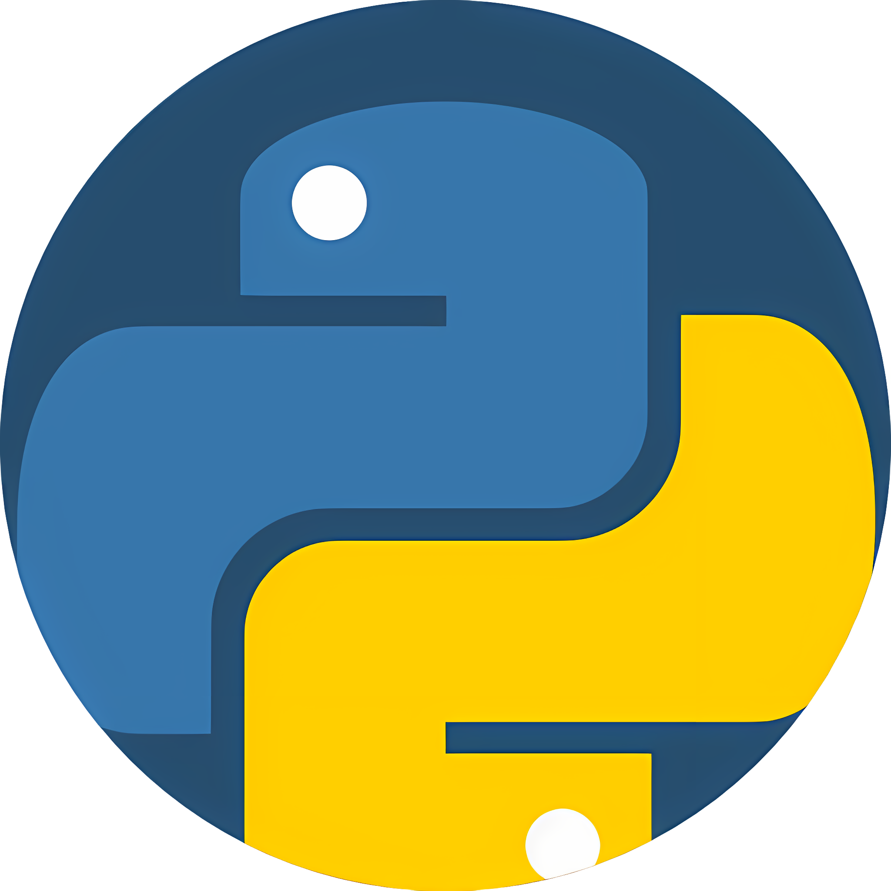

<!--img src='.assets/images/IMG_20241017_084724.jpg' width='128' alt='profile image' style='border-radius:50%;display:block;margin-left:auto;margin-right:auto'-->

---

 Hello, I'm Daniel. I'm hungarian fornt and backend developer.
I learned Java programming at the webler training studio, 
then I also learned python and frontend web development on Udemy.

I used to learn only as a hobby, but now I want to try and improve my knowledge.

I'm currently studying at the: Szent László High School

### Languages and Tools:

---

| Links |  |  |
| :-- | :-- | :-- |
|  |  |  |

---

- 📧 pal.daniel.79@gmail.com

---
